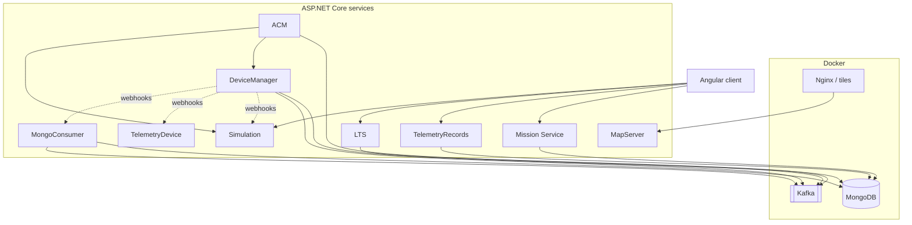

# SMART - Simulation and Management for Advanced Reconnaissance and Tactical operations

## Overview

SMART is a **simulation and command-support** platform for advanced reconnaissance and tactical operations. At runtime it combines:

- **UAV simulation** (multi-aircraft physics, missions, Quartz scheduling, ICD-aligned telemetry semantics).
- **Live telemetry ingestion** (capture, decode, validate, multi-port device management).
- **Mission and assignment services** (suggestions, execution, results, genetic and other assignment algorithms, scenario testing).
- **Fleet and sleeve coordination** (DeviceManager as the persistence and notification hub; ACM for assignment-side orchestration and Kafka-driven status).
- **Durable telemetry and records** (TelemetryRecords on MongoDB; MongoConsumer bridging Kafka notifications into handlers and storage).
- **Live telemetry fan-out** (LTS exposing Kafka-backed UAV snapshots and per-session “wanted fields” for the UI).
- **Geospatial context** (MapServer tiles served through the Nginx gateway).
- **Operator UI** (Angular SPA: assignment review on maps, live view, device management, archive and mission telemetry investigation).

Services integrate through **HTTP** (REST, including **DeviceManager-originated webhooks**), **Apache Kafka**, and **MongoDB**. Local infrastructure is defined under **`docker/`**; convenience scripts live under **`scripts/`**.

**Ports, default URLs, credential defaults, and scripted startup variants** are documented in **`scripts/README.md`** (that file is the source of truth for numbers that change per environment).

---

## System architecture (diagram)


*Visual architecture of SMART components and interactions.*

---

## Logical architecture and dependencies

At a high level:

1. **Infrastructure** (Docker): MongoDB, Kafka, Nginx gateway (and optional compose projects you enable locally).
2. **DeviceManager** is started **before** most other .NET services in `scripts/run-all.bat` (10 second wait) because it owns **UAV and sleeve** documents and **notifies** Simulation, TelemetryDevice, ACM, and MongoConsumer when fleet topology changes.
3. **Simulation** and **TelemetryDevice** run the **live loop** (UAV motion, sniffers, pipelines) and accept **webhooks** from DeviceManager.
4. **ACM** consumes **Kafka**, calls **DeviceManager** and **Simulation**, and receives **sleeve** webhooks from DeviceManager paths as configured.
5. **Mission Service** drives **assignment suggestions**, **apply-assignment** execution, **mission status**, and hosts an extensive **`api/Test`** scenario suite for algorithms.
6. **LTS** exposes **peek** style access to consolidated UAV telemetry derived from Kafka consumption.
7. **TelemetryRecords** serves **paginated mission telemetry pages** and **assignment history** to the client.
8. **MongoConsumer** reacts to **UAV changed** webhooks and Kafka to keep persistence aligned.
9. **Angular client** calls Mission, TelemetryRecords, LTS, Simulation, and other APIs depending on the page (see client routes below).



---

## Core backend services (detailed)

### Simulation (`Simulation/Simulation`)

- **Role:** Primary **UAV flight simulation**: spawn and run UAVs, flight paths, motion and orientation, speed control, pause/resume/abort, multi-UAV runs, integration with **ICD** definitions from **Core**.
- **Scheduling:** **Quartz.NET** for recurring work (telemetry emission, simulation ticks, housekeeping as implemented per job registration).
- **Notable patterns:** `UAVManager`, flight path services, channel models, **DeviceManager webhooks** so fleet changes from DeviceManager update in-memory or stored UAV state.
- **Documentation:** `Simulation/README.md` (UAV catalog: Searcher, Hermes 450, Hermes 900, Heron TP, and related armed/surveillance bases).

### TelemetryDevice (`TelemetryDevice/TelemetryDevice`)

- **Role:** **Live telemetry pipeline**: SharpPcap-based sniffing, handler factory, **validation → decode → output** stages (Dataflow blocks where used), **dynamic add/remove** of telemetry devices and sniff ports.
- **Integration:** **DeviceManagerWebhook** for `sleeve-changed` so port and sleeve topology stays aligned with DeviceManager.
- **Documentation:** `TelemetryDevice/README.md` (pipeline and pattern detail).

### DeviceManager (`DeviceManager/DeviceManager`)

- **Role:** **Fleet authority** for **UAVs** and **Sleeves**: CRUD REST APIs backed by **MongoDB**, **Kafka** producers/consumers as registered in DI, and **notification** paths to Simulation, TelemetryDevice, ACM, and MongoConsumer when UAVs or ports change.
- **Why it is first in `run-all.bat`:** Other services rely on consistent **UAV tail IDs**, **sleeve assignment**, and **port sets** before they bind listeners or run scenarios.

### ACM (`ACM/ACM`)

- **Role:** **Assignment and sleeve-side coordination**: sleeve-related services, **HTTP clients** to DeviceManager and Simulation, **Kafka** services, **assignment** services, and **UAV status consumption** (registration names from `Program.cs`).
- **Webhooks:** Exposes **`POST api/DeviceManagerWebhook/sleeve-changed`** for DeviceManager-driven updates.

### Mission Service (`Mission Service/Mission Service`)

- **Role:** **Mission and assignment** domain: queue assignment suggestions, track **assignment execution** and **results**, **mission status** (active missions per tail), **mission completion** callbacks, **MongoDB** integration, background processing, and **HTTP clients** to other services as configured.
- **Algorithms:** Genetic assignment and related services (see `Services/` tree); **`api/Test`** exposes many **deterministic scenario** and **stress** endpoints for regression and demos.
- **Typical client flow:** `POST .../create-assignment-suggestion` → poll **`api/AssignmentResult/{id}/status`** → fetch **`api/AssignmentResult/{id}`** → optionally `POST .../apply-assignment`.

### LTS (`LTS/LTS`)

- **Role:** **Live telemetry support** for the UI: **Kafka snapshot consumer** to expose current UAV telemetry (`GET api/UAVTelemetryData/all-uav-telemetry-data`), and **session-scoped wanted fields** via **`PUT api/wanted-fields/{sessionId}`** so clients declare which telemetry columns they need.

### TelemetryRecords (`TelemetryRecords/TelemetryRecords`)

- **Role:** **Historical and mission-scoped telemetry** and **assignment records** on MongoDB: mission telemetry pages (with optional time bounds, paging, field filters), telemetry bounds queries, and assignment queries (`latest`, by date, by mission).

### MongoConsumer (`MongoConsumer/MongoConsumer`)

- **Role:** **Integration worker**: Kafka consumption, **HTTP clients**, MongoDB, **hosted services**, and **UAV change handlers** selected from a factory when DeviceManager reports changes.
- **Webhooks:** **`POST api/DeviceManagerWebhook/uav-changed`** (and related DTO handling as implemented).

### MapServer (`MapServer/MapServer`)

- **Role:** **Map stack** for situational displays: map services, **tile generation or storage** under `MapServer/MapServer/tiles` (mounted into the gateway container). **`HealthController`** for readiness checks.
- **Note:** **`scripts/run-all.bat` does not start MapServer**; use `scripts/README.md` manual service list or your own orchestration if you need MapServer every time.

---

## DeviceManager webhooks (cross-service HTTP)

DeviceManager (or callers acting on its behalf) triggers downstream updates through dedicated webhook controllers:

| Target service | Controller route prefix | Example actions |
|----------------|---------------------------|-----------------|
| Simulation | `api/DeviceManagerWebhook` | `uav-changed`, `uav-ports-changed`, `uavs-ports-changed-batch` |
| TelemetryDevice | `api/DeviceManagerWebhook` | `sleeve-changed` |
| MongoConsumer | `api/DeviceManagerWebhook` | `uav-changed` |
| ACM | `api/DeviceManagerWebhook` | `sleeve-changed` |

Exact payloads are the DTOs under each project’s `Models` or `DTOs` folders.

---

## HTTP API reference (representative)

Base paths assume default Kestrel URL and `api/` prefix from each service’s launch profile. Prefer **Swagger** (`/swagger`) when enabled.

### Simulation — `api/Simulation`, `api/Communication`, `api/UAVStatus`, `api/DeviceManagerWebhook`

| Method | Route (relative to controller) | Purpose |
|--------|--------------------------------|---------|
| POST | `api/Simulation/simulate` | Run simulation entry points |
| POST | `api/Simulation/switch` | Destination / scenario switching |
| POST | `api/Simulation/pause/{tailId}` | Pause a UAV |
| POST | `api/Simulation/resume/{tailId}` | Resume |
| POST | `api/Simulation/abort/{tailId}` | Abort one |
| POST | `api/Simulation/abort-all` | Abort all |
| GET | `api/Simulation/status` | Status |
| GET | `api/Simulation/all-uav` | List UAVs |
| GET | `api/Simulation/run`, `run-multi`, `run-20`, `show` | Demo and multi-UAV runs |
| POST | `api/Communication/switch-ports` | Channel / port switching |
| GET | `api/UAVStatus/all-uav`, `active-uav` | UAV status views |

### TelemetryDevice — `api/TelemetryDevice`, `api/Sniffers`, `api/DeviceManagerWebhook`

| Method | Route | Purpose |
|--------|--------|---------|
| POST | `api/TelemetryDevice/add-telemetry-device` | Register a device |
| POST | `api/TelemetryDevice/remove-telemetry-device` | Remove |
| GET | `api/TelemetryDevice/run` | Start processing |
| POST | `api/TelemetryDevice/switch-port` | Port switch |
| POST | `api/Sniffers/add-port` | Add sniffer port |
| POST | `api/Sniffers/remove-port` | Remove port |
| GET | `api/Sniffers/run` | Run sniffers |

### DeviceManager — `api/UAV`, `api/Sleeve`

| Method | Route | Purpose |
|--------|--------|---------|
| GET/POST/PUT/DELETE | `api/UAV`, `api/UAV/{tailId}` | UAV CRUD |
| GET/POST/PUT/DELETE | `api/Sleeve`, `api/Sleeve/{name}` | Sleeve CRUD |
| GET | `api/Sleeve/available-for-uav/{tailId}` | Query availability |
| POST | `api/Sleeve/release/{tailId}` | Release |
| POST | `api/Sleeve/assign` | Assign sleeve to UAV |

### Mission Service

| Area | Route | Purpose |
|------|--------|---------|
| Assignments | `POST api/Assignment/create-assignment-suggestion` | Queue suggestion; returns assignment id and status URL |
| Assignments | `POST api/Assignment/apply-assignment` | Execute chosen assignment |
| Results | `GET api/AssignmentResult/{assignmentId}` | Fetch and consume result |
| Results | `GET api/AssignmentResult/{assignmentId}/status` | Poll execution status |
| Mission status | `GET api/mission-status/active-missions` | All active missions |
| Mission status | `GET api/mission-status/active-mission/{tailId}` | Per-tail active mission |
| Mission status | `POST api/mission-status/mission-completed/{tailId}` | Clear active mission |
| Test / scenarios | `GET api/Test/scenarios`, `POST api/Test/scenarios/missions` | Scenario registry |
| Test / algorithms | `GET api/Test/test/*` | Many named tests (equal assignment, resource constraints, overlap, priority, telemetry optimization, stress, edge cases, etc.) |

### LTS

| Method | Route | Purpose |
|--------|--------|---------|
| GET | `api/UAVTelemetryData/all-uav-telemetry-data` | Current snapshots (Kafka-backed) |
| PUT | `api/wanted-fields/{sessionId}` | Update wanted field set for a session |

### TelemetryRecords

| Method | Route | Purpose |
|--------|--------|---------|
| GET | `api/TelemetryData/by-mission` | Mission telemetry page (query: missionId, tailId, optional fields, time range, paging) |
| GET | `api/TelemetryData/bounds` | Time bounds for telemetry |
| GET | `api/AssignmentRecords/latest` | Latest stored assignment |
| GET | `api/AssignmentRecords/by-date/{date}` | By date |
| GET | `api/AssignmentRecords/by-mission/{missionId}` | By mission |

### MapServer

| Method | Route | Purpose |
|--------|--------|---------|
| GET | `api/Health` | Health check |

### Gateway static tiles

- Nginx serves **`/tiles/`** from the container root per `docker/nginx/nginx.conf` (tiles on disk come from the MapServer mount in `docker-compose.gateway.yml`).

---

## Angular client (`client/`)

- **Stack:** Angular (see `client/README.md` for CLI version), `ng serve` default **`http://localhost:4200`**.

### Application routes (`app-routing.module.ts`)

| Path | Component (purpose) |
|------|---------------------|
| `''` | Redirects to assignment page |
| `assignment-page` | Assignment workspace: scenarios, mission editing, **map-based assignment review** (markers, filters, tooltips, algorithm panels, summaries, dialogs) |
| `live-view-page` | Live situational view |
| `device-management-page` | Device and fleet management UI |
| `archive` | Archive landing |
| `archive/investigate` | **Mission telemetry** deep dive (charts, time range, related archive components) |

### Typical client dependencies

- **Mission Service** for assignments, scenarios, and tests where the UI invokes them.
- **TelemetryRecords** for mission telemetry pages and assignment history.
- **LTS** for live telemetry snapshots and wanted-fields updates.
- **Simulation / DeviceManager** as configured in environment files and Angular services under `client/src/app/`.

---

## Data platform and infrastructure

| Layer | Files | Role |
|-------|--------|------|
| MongoDB | `docker/docker-compose.mongodb.yml` | Document database for DeviceManager, Mission Service, TelemetryRecords, MongoConsumer, and related persistence. |
| Kafka | `docker/docker-compose.messaging.yml` | Broker for ACM, LTS snapshots, DeviceManager, MongoConsumer, and other registered producers/consumers. |
| Nginx | `docker/docker-compose.gateway.yml`, `docker/nginx/nginx.conf` | HTTP on host port **80** → container **8080**; static **`/tiles/`** with cache headers. |
| Core | `Core/Core/Files/ICD/*.json` | **ICD** telemetry definitions (e.g. `NorthICD_telemetry.json`, `SouthICD_telemetry.json`) referenced from Simulation configuration. |
| Shared | `Shared/` | Additional shared libraries referenced by solutions in this repository. |

---

## Key features (system-wide, expanded)

**Simulation**

- Multiple **armed** and **surveillance** UAV archetypes with distinct performance and payload modeling.
- **Flight path** pipeline: motion, orientation, speed, validation; **multi-UAV** run endpoints.
- **ICD**-driven telemetry fields aligned with **Core** JSON.
- **Quartz**-based periodic jobs (telemetry generation, simulation stepping, maintenance tasks).

**Telemetry**

- **Live pipeline** with validation, ICD decode, and pluggable outputs.
- **Dynamic ports** and **multi-device** lifecycle.
- **TelemetryRecords** for **mission-scoped** history and **paging**.
- **LTS** for **operator-selected field sets** and **live snapshot** readout.

**Missions and assignments**

- **Suggestion queue**, **async execution**, **result retrieval**, and **apply** path for committed assignments.
- **Mission status** per tail and global active mission list.
- **Large automated test surface** under `api/Test` for algorithm and scenario validation.

**Operations and integration**

- **DeviceManager** as **authoritative** UAV/sleeve store with **outbound notifications**.
- **MongoConsumer** for **event-driven** persistence updates.
- **MapServer + Nginx** for **map-backed** assignment and live views.
- **Scripts** for compose-all, per-stack compose, and multi-window **`run-all.bat`** (see limitations above for MapServer).

---

## Project structure

```
├── client/                      # Angular SPA
├── Simulation/Simulation/       # Simulation API host project
├── TelemetryDevice/TelemetryDevice/
├── DeviceManager/DeviceManager/
├── ACM/ACM/
├── Mission Service/Mission Service/
├── LTS/LTS/
├── TelemetryRecords/TelemetryRecords/
├── MongoConsumer/MongoConsumer/
├── MapServer/MapServer/
├── Core/                        # ICD + shared models/services
├── Shared/
├── docker/                      # Compose stacks + nginx config
├── scripts/                     # compose-*.bat, run-all.bat, UML, utilities
└── UML/
```

---

## Getting started

### Prerequisites

- **.NET 9 SDK** (align with solution targets).
- **Docker Desktop** or Docker Engine with Compose v2.
- **Node.js** and **npm** for the client.
- On Windows: **cmd** or **PowerShell** for `scripts/*.bat`.

### Quick start (Windows)

1. Clone and enter the repository.
2. `scripts\compose-all.bat` — brings up MongoDB, Kafka, gateway (and any other `docker-compose.*.yml` in `docker/` processed by that script).
3. `scripts\run-all.bat` — starts DeviceManager (wait), ACM, Simulation, TelemetryDevice, LTS, Mission Service, TelemetryRecords, MongoConsumer, then **`ng serve`** in `client/`.
4. For **MapServer** or non-Windows flows, follow **`scripts/README.md`**.

### Run individual services

Use the `cd … && dotnet run` examples from the previous section; always match **folder casing** on disk (Windows paths in `run-all.bat` use short names like `Simulation\simulation`).

---

## Configuration

### ICD

- Files under **`Core/Core/Files/ICD/`** (for example `NorthICD_telemetry.json`, `SouthICD_telemetry.json`).
- **`Simulation/Simulation/appsettings.json`** — `ICD` section points at the effective ICD directory (verify relative paths from the running working directory).

### Per-service settings

Each service uses **`appsettings.json`** / **`appsettings.Development.json`** for Mongo connection strings, Kafka brokers, HTTP base URLs for peer services, and Kestrel URLs. Treat these as **environment-specific**; do not commit secrets.

### Communication and UAV modeling

- **CommunicationController** (Simulation) — programmatic **port switching** for multi-channel radio modeling.
- **UAV properties** — sensors, weapons, flight envelopes, and mission parameters are represented in Simulation models and configuration; see `Simulation/README.md` for the UAV matrix.

---

## Simulation service internals (summary)

- **Flight path service:** motion, orientation, speed, validators.
- **UAV manager:** lifecycle and mission binding for armed and surveillance UAVs.
- **Port manager:** allocation and switching for telemetry and comms endpoints.
- **Quartz:** scheduled telemetry and simulation maintenance work.

---

## Docker (per stack)

- **Messaging:** `docker-compose.messaging.yml` — Kafka broker, listeners, single-node controller settings, persistent volume.
- **Gateway:** `docker-compose.gateway.yml` — Nginx, tile volume mount from MapServer, config bind mount.
- **MongoDB:** `docker-compose.mongodb.yml` — instance for local development (see `scripts/README.md` for connection string patterns used by scripts).

---

## Development

### Build

```bash
dotnet build Simulation/Simulation.sln
```

For any other service, build that project’s **`.csproj`** directly (examples in repository root **`CLAUDE.md`**).

### Tests

```bash
dotnet test Simulation/
```

Add paths for Mission Service, TelemetryDevice, or other test projects as they exist in your checkout.

### Layering (typical C# services)

Controllers stay thin; **services** own workflows; **repositories** own MongoDB or external I/O; **DTO/Ro/entity** boundaries are explicit where the project follows the repository `CLAUDE.md` conventions.

### Client

```bash
cd client
npm ci   # or npm install
ng build
ng test
```

---

## Monitoring and telemetry

Operational visibility combines **Simulation** and **TelemetryDevice** logs, **Kafka** consumer lag (where instrumented), **MongoDB** collections for missions and telemetry, **LTS** snapshot endpoints, and **TelemetryRecords** historical queries. Use Docker logs and per-service consoles started from `run-all.bat` windows.

---

## Contributing

Follow team review practices, keep changes scoped, and respect **`CLAUDE.md`** for cross-cutting C# rules. Run **build** and **tests** for every project you touch before opening a pull request.

---

## License

[License information to be added]

---

## Support

Use **`scripts/README.md`** for startup and troubleshooting, **`client/README.md`** for the SPA, and per-service **`README.md`** files under `Simulation/`, `TelemetryDevice/`, and other folders when present.
